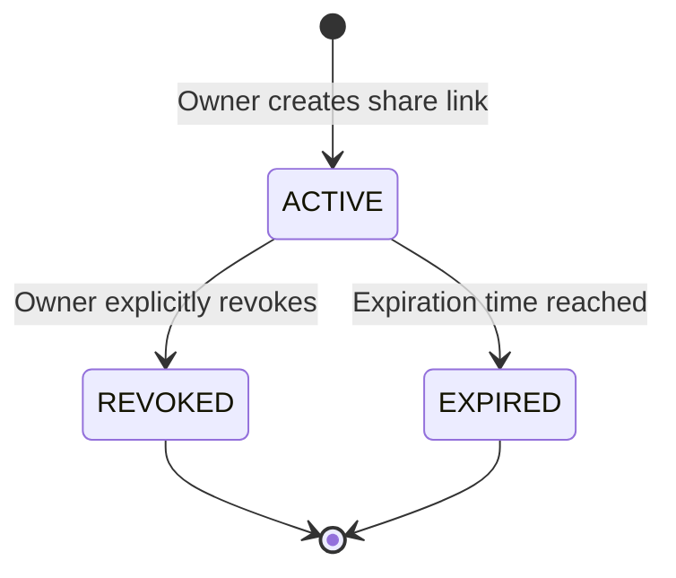
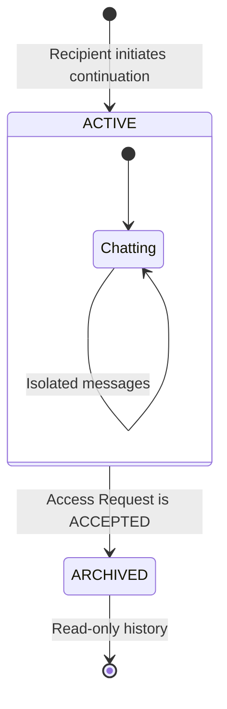
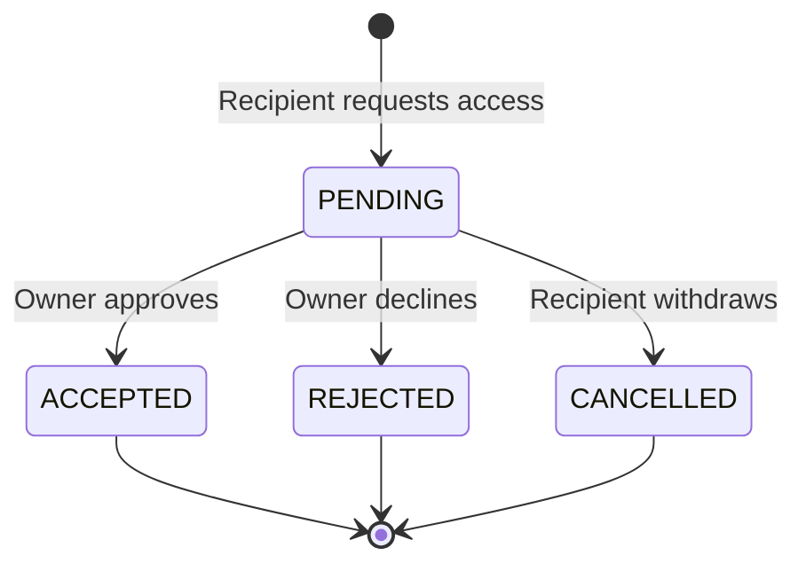
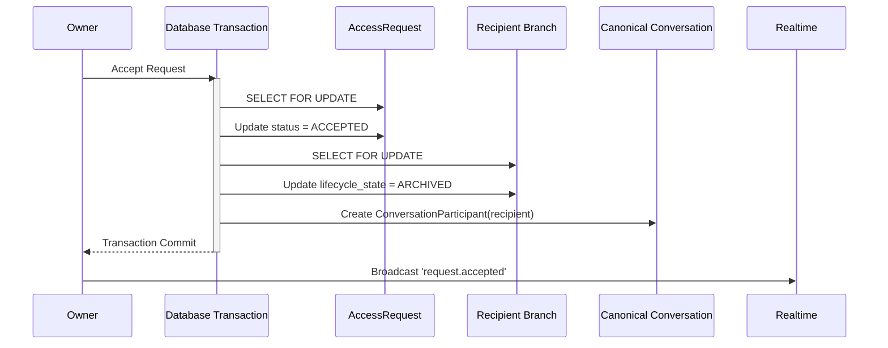

# V2 Sharing and Collaboration State Machine

This document defines the strict lifecycle transitions for Shares, Access Requests, and Branches in SynapseLM V2, including transactional guarantees.

## 1. Conversation Share State Machine

The share token dictates the validity of new access attempts (branches and requests). Existing branches are unaffected by revocation.

## 2. Recipient Branch State Machine

The branch governs the recipient's isolated workspace.

## 3. Access Request State Machine

The access request governs the explicit collaboration agreement.

## 4. Atomic Cross-Entity Acceptance Transition

When an owner accepts a pending access request, a critical cross-entity transition occurs. This **MUST** be executed as an atomic database transaction using row-level locks (`SELECT ... FOR UPDATE`) to prevent concurrent modification races.

### Transition Table (Acceptance)

| Entity | Pre-State | Post-State | Effect |
| :--- | :--- | :--- | :--- |
| **AccessRequest** | `PENDING` | `ACCEPTED` | Request is finalized. |
| **Branch** | `ACTIVE` | `ARCHIVED` | Recipient can no longer send messages to the branch. |
| **Canonical Conv** | Recipient is unauthorized | Recipient is `Participant` | Recipient can now read live canonical messages and write directly to the canonical conversation. |

### Concurrency and Transaction Boundaries
- **Accept vs Reject Races**: The API uses `SELECT ... FOR UPDATE` on the `ConversationAccessRequest` row, verifying `status == PENDING` before applying any state change.
- **Duplicate Pending Requests**: A partial unique index on the database (`share_id`, `requester_id`) where `status = 'PENDING'` ensures a user cannot spam multiple active requests.
- **Branch Archival vs Message Write**: Message creation endpoints lock the `Conversation` row (`SELECT ... FOR UPDATE`) and verify `lifecycle_state == ACTIVE`. If an accept transaction archives the branch simultaneously, the message write will safely abort.
- **Realtime Publishing**: Redis broadcasts (`request.accepted`, `message.created`) MUST only be dispatched *after* the database transaction commits successfully, ensuring clients do not fetch stale state.
