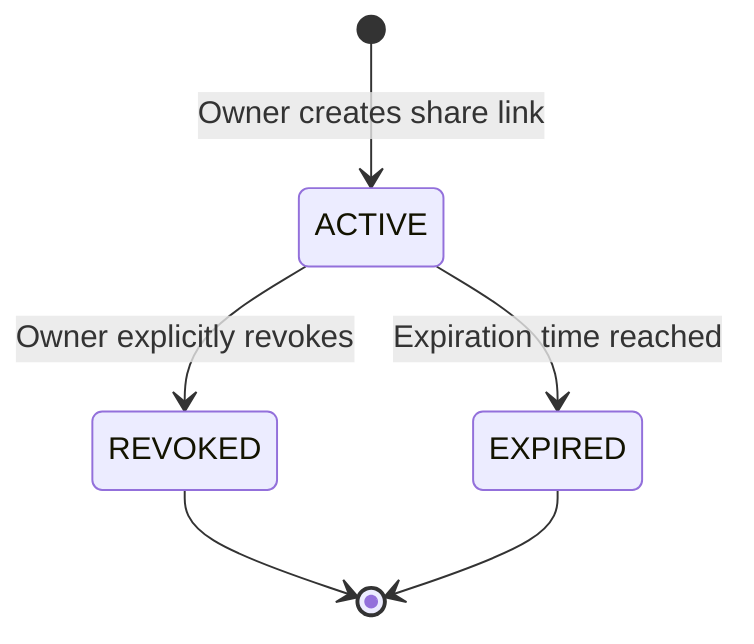
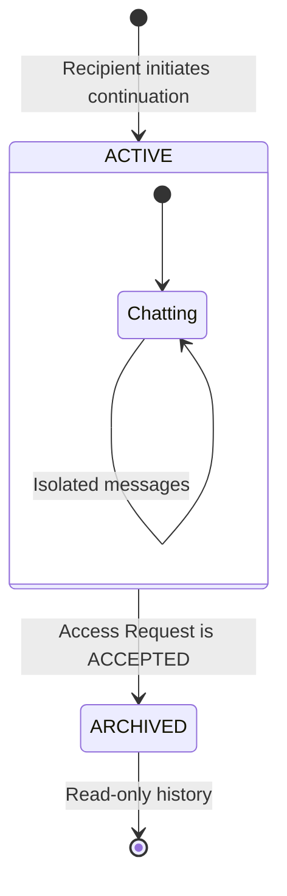
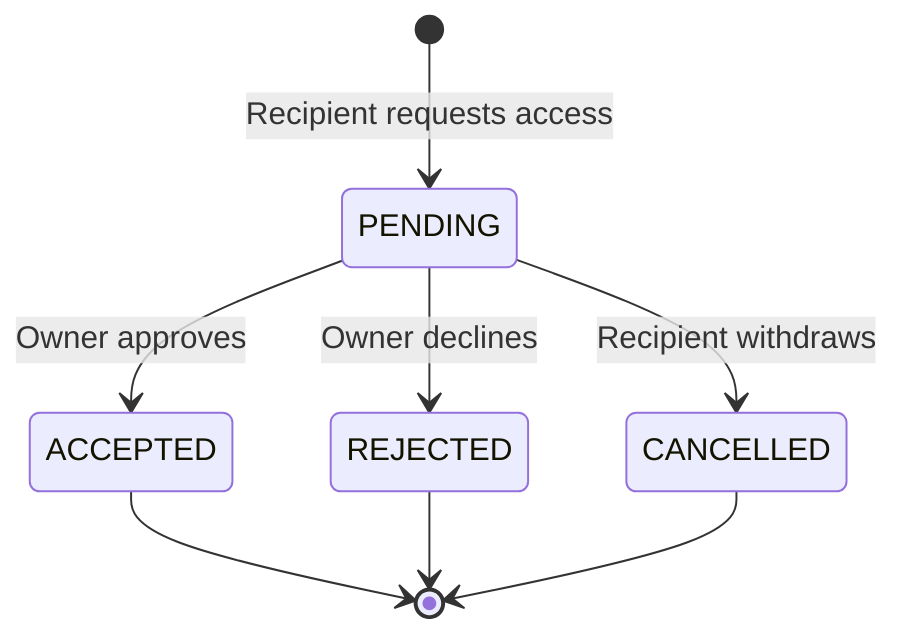
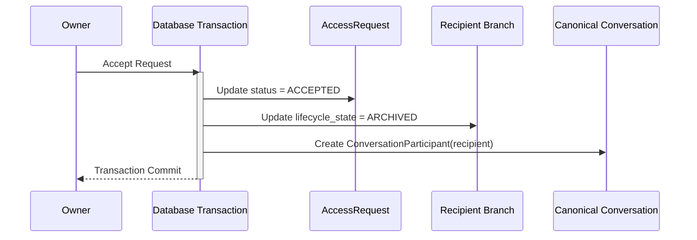

# V2 Sharing and Collaboration State Machine

This document defines the strict lifecycle transitions for Shares, Access Requests, and Branches in SynapseLM V2.

## 1. Conversation Share State Machine

The share token dictates the validity of new access attempts.

## 2. Recipient Branch State Machine

The branch governs the recipient's isolated workspace.

## 3. Access Request State Machine

The access request governs the explicit collaboration agreement.

## 4. Atomic Cross-Entity Acceptance Transition

When an owner accepts a pending access request, a critical cross-entity transition occurs. This **MUST** be executed as an atomic database transaction to prevent corrupted state.

### Transition Table (Acceptance)

| Entity | Pre-State | Post-State | Effect |
| :--- | :--- | :--- | :--- |
| **AccessRequest** | `PENDING` | `ACCEPTED` | Request is finalized. |
| **Branch** | `ACTIVE` | `ARCHIVED` | Recipient can no longer send messages to the branch. |
| **Canonical Conv** | Recipient is unauthorized | Recipient is `Participant` | Recipient can now read live canonical messages and write directly to the canonical conversation. |

### Edge Case Constraints
- A request can only transition to `PENDING` if the associated `ConversationShare` is `ACTIVE`.
- If a `ConversationShare` becomes `REVOKED`, existing `PENDING` requests may remain pending or be auto-rejected depending on product policy, but new requests are blocked.
- A `Branch` remains `ACTIVE` if a request is `REJECTED` or `CANCELLED`, allowing the user to continue isolated interaction.
